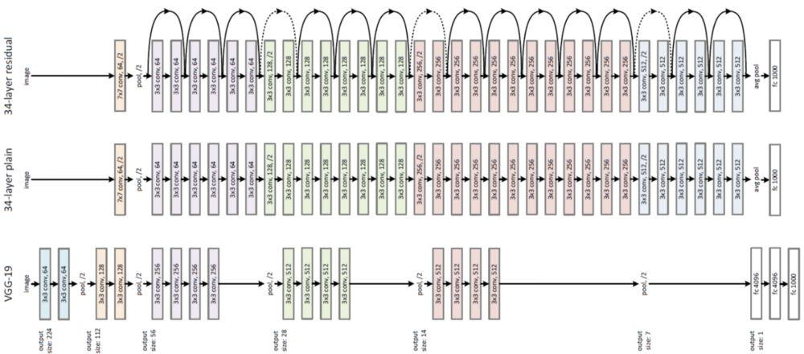
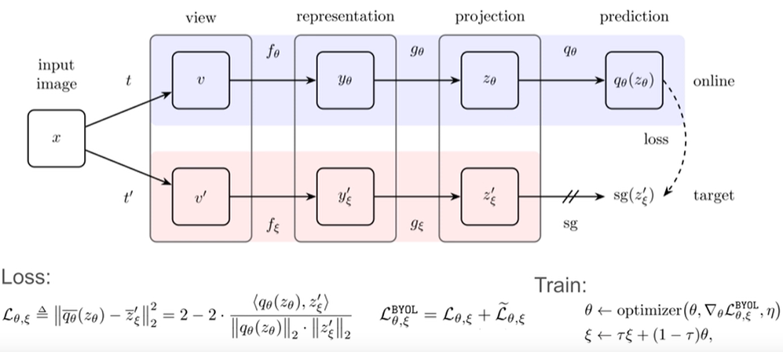
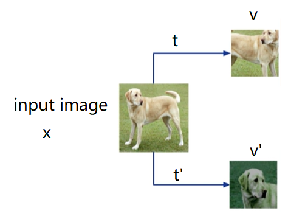
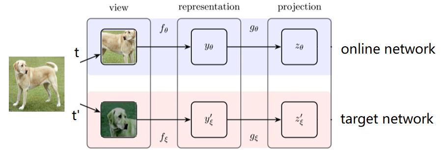
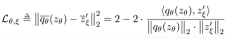
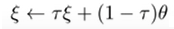
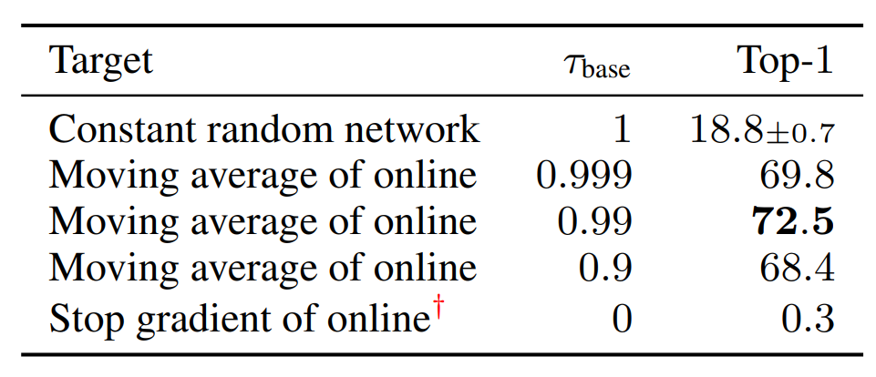
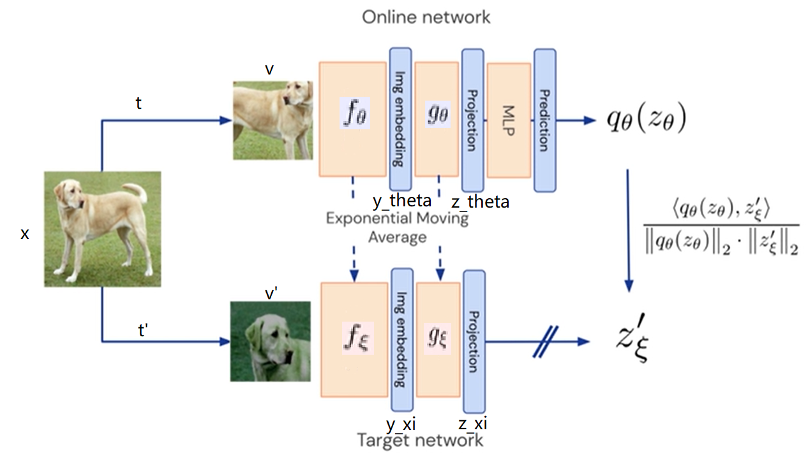
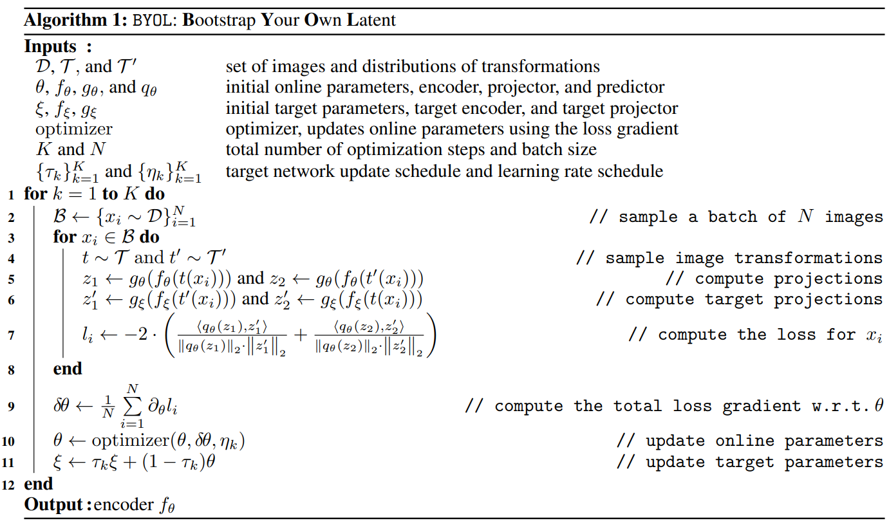

# Bootstrap your own latent A new approach to self-supervised Learning

引导你自己潜在的自我监督学习的新方法

论文链接：https://arxiv.org/abs/2006.07733

此库为BYOL自监督学习的原理性复现代码，使用最简单易读的方式，编写，没有使用复杂的函数调用。总计两百余行代码。完全按照算法顺序编写。并给出了，网络训练好以后的冻结网络参数，续接网络层，继续训练几轮的测试代码。

该库仅仅是对其方法的介绍性复现，可能无法到达论文介绍精度。如果需要进一步使用，需要在读懂原理基础上，更进一步优化代码，训练、测试和使用。


## 为什么使用自监督学习


网络更加庞大，难以训练，需要大量的标记数据来监督训练，成本过高。所以需要一种自监督学习，来训练网络，使网络更加泛化。





## 方法



输入一张图片(input image)，记作 $x$  ，通过两种随机的图像增强策略（记作：$t$，$t^{'}$），得到两种不同的图片（记作：$v$，$v^{'}$），但语义内容相同的图片。




再将图片 $v$ 输入网络（ 网络记作$f_{\theta}$，其中网络参数为 $\theta$ ）中，得到这张图片对于网络 $f_{\theta}$ 的一个表示（representation， $y_{\theta}$ ），也就是说是，图片输入网络后，得到的特征图（feature map）为 $y_{\theta}$ 。之后将 $y_{\theta}$ 输入 后续网络（记作  $g_{\theta}$ ），将 $y_{\theta}$ 的特征图投射至一个更加高维的潜在空间，得到输出特征向量 $z_{\theta}$ ;

相同的图片 $v^{'}$ 输入另一和网络 $f_{\theta}$ 相同的，但参数不同的网络（记作 $f_{\xi}$ ，参数为  $\xi$  ），得到输出 $y_{\xi}^{'}$ ，再输入网络 $g_{\xi}$ （与 $g_{\theta}$  相同，但参数不同），得到输出特征向量 $z_{\xi}^{'}$；




将参数为 $\theta$  的网络称为在线网络（ online network ），参数为 $\xi$ 的网络称为目标网络（target network）

我们想要网络projection空间中的，$z_{\theta}$ 和 $z_{\xi}^{'}$ 相同，但是这两个输出来源于同一幅图片的随机图像增强，而且输入结构相同参数不同的网络，得到投影(projection)的特征向量必然是不同的，如果强制学习到相同输出，网络可能就直接输出常数了。所以再加上一层网络 $q_{\theta}$，将 $z_{\theta}$ 再一次变换，使得变换后的输出$q_{\theta}(z_{\theta})$ 与   $z_{\xi}^{'}$ 比较距离，做损失。



由此优化在线网络（ online network ）的参数 $\theta$ ;

而目标网络（target network）的参数 $\xi$ 更新，根据旧的 $\xi$ 和更新后的 $\theta$，按照以下公式更新



系数 $\tau$ 的 大小选择，在 $\tau = 1$ 的时候表示，目标网络（target network）的参数一直都不变，就是一个学习随机网络的输出的结果，为18.8。而 $\tau = 0$ 时，表示目标网络完全由在线网络（online network)的参数替换，相当于每次都更新网络参数，这时候，效果非常差，相当于训练崩塌。而中间的3种取值悬着，让目标网络权重更新不会太快，而不会太慢。可以看出在 $\tau =0.99$时，效果最优





算法流程：




## 代码

在线网络，和目标网络，使用resnet18

```python
online_net = ResNet18()  # 实例化online（在线网络）
target_net = ResNet18()  # 实例化target（目标网络）
```

投射网络  $q_{\theta}$ 为：

```python
from torch import nn


class MLP(nn.Module):
    """
    预测网络, 将在在线网络的输出投射至另一空间来预测目标网络的输出
    """
    def __init__(self, in_features, hidden_features, projection_features):
        """
        预测网络
        :param in_features: 输入特征数
        :param hidden_features: 隐藏特征数
        :param projection_features: 投影特征数
        """
        super(MLP, self).__init__()
        self.layer = nn.Sequential(
            nn.Linear(in_features, hidden_features),
            nn.BatchNorm1d(hidden_features),
            nn.ReLU(inplace=True),
            nn.Linear(hidden_features, projection_features),
        )

    def forward(self, x):
        return self.layer(x)
```

数据集使用CIFAR10 

对图像的数据增强方式

```python
class TransformsSimCLR:
    """
    一种随机数据扩充模块，它对任意给定的数据实例进行随机转换，
    得到同一实例的两个相关视图，
    记为x̃i和x̃j，我们认为这是一个正对。
    """

    def __init__(self, size, train=True):
        """
        :param size:图片尺寸
        """
        s = 1
        color_jitter = torchvision.transforms.ColorJitter(
            0.8 * s, 0.8 * s, 0.8 * s, 0.2 * s
        )
        self.train_transform = torchvision.transforms.Compose(
            [
                torchvision.transforms.RandomResizedCrop(size=size),
                torchvision.transforms.RandomHorizontalFlip(),  # with 0.5 probability
                torchvision.transforms.RandomApply([color_jitter], p=0.8),
                torchvision.transforms.RandomGrayscale(p=0.2),
                torchvision.transforms.ToTensor(),
            ]
        )

        self.test_transform = torchvision.transforms.Compose(
            [
                torchvision.transforms.Resize(size=size),
                torchvision.transforms.ToTensor(),
            ]
        )
        self.train = train

    def __call__(self, x):
        """
        :param x: 图片
        :return: x̃i和x̃j，即 v、v'
        """

        if self.train:
            return self.train_transform(x), self.train_transform(x)
        else:
            return self.test_transform(x)
```

训练过程中，将同一张图片，经过随机数据增强得到两张不同的图片，分别输入在线网络和目标网络，得到各自得projection，同时，对于目标网络，不追踪梯度。

```python
online_projection_one = online_net(x_i)
with torch.no_grad():
    target_projection_one = target_net(x_j)
```

然后将在线网络输出得projection，经过prediton的变换，与目标网络的projection做损失：

```python
prediction = MLP(in_features=1000, hidden_features=2048, projection_features=1000)
```

```python
loss_one = loss_function(prediction(online_projection_one), target_projection_one.detach())
```

损失函数为：

```python
def loss_function(predict, target):
    """
    损失函数，比较余弦相似度。归一化的欧氏距离等价于余弦相似度
    :param predict: online net输出的prediction
    :param target: target网络输出的projection
    :return: loss(损失)
    """
    return 2-2*torch.cosine_similarity(predict, target, dim=-1)
```

由此，优化参数 $\theta$

而目标网络参数的更新，根据在线网络更新：

```python
for target_parameter, online_parameter in zip(target_net.parameters(), online_net.parameters()):
    old_weight = target_parameter.data
    update = online_parameter.data
    target_parameter.data = old_weight * tau + (1 - tau) * update
```

系数 $\tau$ 取为0.99

将训练得到的在线网络的权重保存


使用过程，就是冻结网络参数，后续接上一层网络，训练微调一下，即可使用。


## 安装

Python >= 3.6.0 要求安装 [requirements.txt](https://github.com/ultralytics/yolov5/blob/master/requirements.txt) 所有依赖项:

```python
$ pip install -r requirements.txt
```


## 训练

运行代码，将自动下载CIFAR10数据集，经行训练

```python
$ python train.py
```


## 测试

运行代码，将使用训练好的权重，并不优化网络权重，额外训练一层线性分类层，测试该无监督学习在CIFAR10数据集中测试集中的表现。

```python
$ python test.py
```

